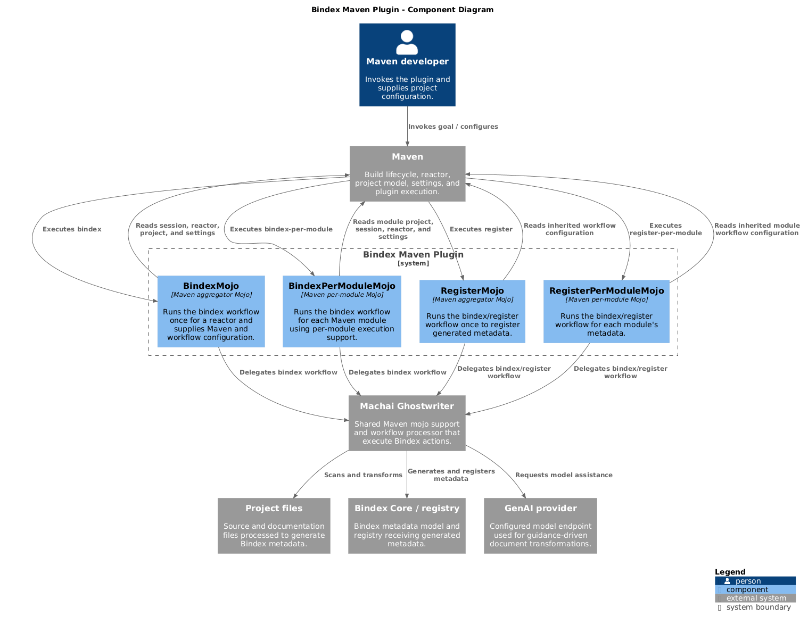

<!-- @guidance:
**Objective:** Generate a well-structured and professional `README.md` file for the project. Follow the outlined structure and formatting requirements to ensure the README is clear, concise, and easy to navigate. If any section or content already exists, update it with the latest and most accurate information instead of duplicating or skipping it.
# Project Title and Overview
- **Title:** Add the project name as the main title.
- **Maven Badge:** Add the Maven Central badge as a new paragraph below the title: ([!\[Maven Central\](https://img.shields.io/maven-central/v/[groupId]/[artifactId].svg)](https://central.sonatype.com/artifact/[groupId]/[artifactId])
- **Description:** Review project classes.
- Use: src/site/resources/images/c4-diagram.png
# Installation Instructions
- **Repository Cloning:** Include instructions on how to clone the repository.
- **Build Instructions:** Provide steps to build the project using Maven or Gradle.
- **Prerequisites:** Specify any prerequisites, such as:
  - Required Java version.
  - Build tools (e.g., Maven, Gradle).
  - Any system dependencies.
# Usage
- **General Usage:** Explain how to run or use the project and its modules.
- **Examples:** Provide example commands, configurations, or code snippets to demonstrate usage.
- **Module-Specific Instructions:** If applicable, include usage instructions for individual modules.
- **Key capabilities** bullet list covering: aggregator scanning (runs without a Maven project, resolves path from `-Dgw.path` or cwd); 
	per-module execution integrated with Maven's reactor, avoiding duplicate scans; action execution via Machai Ghostwriter `ActProcessor`; 
	metadata registration via `bindex/register` workflow; GenAI provider/model + credential resolution from `settings.xml` `<server>` entries; 
	parallel-build awareness (honors Maven concurrency).
- **Goals** table (`Goal | Mojo | Description`) for the maven plugin.
- **Parameters** table (`Parameter | Property | Description`) for the maven plugin.
# Contributing
- **Guidelines:** Outline the guidelines for contributing to the project, such as:
  - Code style or formatting requirements.
  - Pull request process.
  - Issue reporting process.
- **Encouragement:** Encourage contributions from the community.
# License
- **License Information:** State the project's license (e.g., MIT, Apache 2.0).
- **License Link:** Provide a link to the `LICENSE` file in the repository.
# Contact and Support
- **Contact Information:** Include contact details for support or inquiries.
- **Support Links:** Provide links to:
  - The project’s issue tracker.
  - Documentation or FAQs.
  - Any relevant community forums or chat channels.
-->

# Bindex Maven Plugin

[](https://central.sonatype.com/artifact/org.machanism.machai/bindex-maven-plugin)

The Bindex Maven Plugin runs Machai Ghostwriter workflows from Maven to generate and register Bindex metadata. It provides reactor-wide and per-module goals that delegate work to Machai's `ActProcessor`, so metadata processing can be integrated into normal Maven builds.



## Installation

### Prerequisites

- JDK 17 or later (the project compiles with `maven.compiler.release=17`).
- Apache Maven 3.8+.
- No additional system dependencies are required. A GenAI provider account is only needed when the selected workflow requires one.

### Clone and build

```bash
git clone https://github.com/machanism-org/bindex-maven-plugin.git
cd bindex-maven-plugin
mvn clean verify
```

The project is a Maven plugin; Gradle is not required. To invoke a published version without adding it to a `pom.xml`, use its fully qualified goal:

```bash
mvn org.machanism.machai:bindex-maven-plugin:<version>:bindex -Dgw.path=.
```

Alternatively, declare the plugin in the consuming project's build:

```xml
<plugin>
  <groupId>org.machanism.machai</groupId>
  <artifactId>bindex-maven-plugin</artifactId>
  <version><!-- use a released version --></version>
</plugin>
```

## Usage

Run the aggregator goal from a project directory, or from any directory when supplying a scan path. It runs once for the invocation and executes the `bindex` Ghostwriter action:

```bash
mvn bindex:bindex -Dgw.path=src/site -Dgw.model=openai:gpt-4o-mini
```

For multi-module projects, bind or invoke `bindex-per-module` when each Maven module needs its own execution:

```bash
mvn bindex:bindex-per-module -Dgw.path=src/site
```

Register generated metadata through the `bindex/register` workflow:

```bash
mvn bindex:register -Dgw.path=.
# Or register in each reactor module:
mvn bindex:register-per-module -Dgw.path=.
```

### Credentials and model configuration

The plugin resolves provider/model configuration from `-Dgw.model` and credentials from a Maven `settings.xml` `<server>` selected with `-Dgenai.serverId`:

```xml
<server>
  <id>machai-genai</id>
  <username>your-api-user</username>
  <password>your-api-key</password>
</server>
```

```bash
mvn bindex:bindex \
  -Dgw.path=src/site \
  -Dgw.model=openai:gpt-4o-mini \
  -Dgenai.serverId=machai-genai
```

### Key capabilities

- **Aggregator scanning:** `bindex` runs without a Maven project and resolves its scan path from `-Dgw.path`, or from the current working directory when no path is supplied.
- **Reactor-aware per-module execution:** `bindex-per-module` executes in each Maven module's context, coordinating with the reactor to avoid duplicate scans.
- **Ghostwriter actions:** the goals delegate action execution to Machai Ghostwriter's `ActProcessor`.
- **Metadata registration:** `register` and `register-per-module` execute the `bindex/register` workflow.
- **GenAI configuration:** provider/model selection and credentials can be resolved from `settings.xml` `<server>` entries.
- **Parallel builds:** all goals are thread-safe and honor Maven's configured build concurrency.

### Goals

| Goal | Mojo | Description |
| --- | --- | --- |
| `bindex` | `BindexMojo` | Runs the `bindex` action once for a reactor or an explicitly selected path; no Maven project is required. |
| `bindex-per-module` | `BindexPerModuleMojo` | Runs the `bindex` action for every Maven module in which it is configured. |
| `register` | `RegisterMojo` | Runs the reactor-wide `bindex/register` action; no Maven project is required. |
| `register-per-module` | `RegisterPerModuleMojo` | Runs the `bindex/register` action for each configured Maven module. |

### Parameters

| Parameter | Property | Description |
| --- | --- | --- |
| `basedir` | `${basedir}` | Base directory used to resolve relative workflow paths. |
| `configFile` | `gw.config` | Optional Ghostwriter workflow configuration file. |
| `model` | `gw.model` | GenAI model identifier for the workflow. |
| `instructions` | `gw.instructions` | Additional instructions passed to the workflow. |
| `excludes` | `gw.excludes` | Path patterns to exclude from processing. |
| `serverId` | `genai.serverId` | Maven `settings.xml` server ID from which workflow credentials are resolved. |
| `params` | — | Additional action-specific parameters supplied in plugin configuration. |
| `project` | `${project}` | Current Maven project, available when Maven supplies one. |
| `session` | `${session}` | Current Maven session and reactor context. |
| `settings` | `${settings}` | Effective Maven settings, including configured servers. |

## Contributing

Contributions are welcome. Please open an issue before substantial work to discuss the proposed change, then create a focused branch and submit a pull request against `main`.

- Follow the existing Java formatting, naming, and Javadoc conventions; keep changes small and readable.
- Run `mvn clean verify` before opening a pull request and include tests or documentation updates when relevant.
- Report reproducible defects through the issue tracker, including Maven, JDK, plugin version, command, and relevant sanitized output.
- Use clear commit and pull-request descriptions that explain the motivation and validation performed.

## License

This project is licensed under the [Apache License 2.0](LICENSE.txt).

## Contact and support

For questions and support, contact [Viktor Tovstyi](mailto:viktor.tovstyi@gmail.com) or visit [Machanism.org](https://machanism.org).

- [Issue tracker](https://github.com/machanism-org/bindex-maven-plugin/issues)
- [Machai documentation and FAQs](https://github.com/machanism-org/machai)
- [Machanism.org](https://machanism.org)
